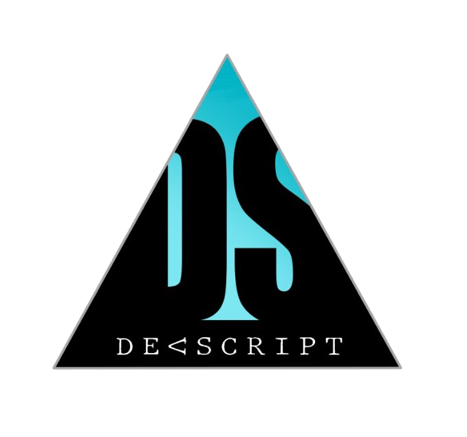

<!---->

<h2 align="center">Hi there, I am <a href="https://rishikeshrajrxl.github.io/">Rishikesh</a></h2>
 <h1 align="center">I am anDeveloper </h1
 

 <h1  align="center">Technical Skills 🛠</h1>
 
 
 
    
    
    
    
    
    
    
    
    
   
   
   
 
  
 

<h3>What I do? 👨‍💻</h3>

Problem Solving 📝

  <ul>
    <li><a href="https://auth.geeksforgeeks.org/user/rishikesh_raj/practice/">GeeksForGeeks</a></li>
    <li><a href="https://www.hackerrank.com/rishikeshraj">Hackerrank</a></li>
    <li><a href="https://leetcode.com/progress/">LeetCode</a></li>
    <li><a href="https://www.codechef.com/users/rishi123raj">CodeChef</a></li>
    <li>Many more on and out of Github...</li>
  </ul>

Machine Laearning | Data Science 📊

<ul>
  <li><a href="https://github.com/Rishikeshrajrxl/Predict-Loan-Eligibility-for-Dream-Housing-Finance-company">Predicting Loan Eligibility for Dream Housing Finance company</a></li>
  <li><a href="https://github.com/Rishikeshrajrxl/Heart-Disease-Predictor">Heart Disease Predictor</a></li>
  <li><a href="https://github.com/Rishikeshrajrxl/Titanic-Machine-Learning-from-Disaster">Titanic-Machine-Learning-from-Disaster</a></li>
  <li><a href="https://github.com/Rishikeshrajrxl/Predicting-Boston-House-Prices">Predicting-Boston-House-Prices</a></li>
  <li><a href="https://zindi.africa/users/Rishikeshrajrxl/competitions">Flight Delay Prediction Challenge</a></li>
  <li>Many more on and out of Github...</li> 
</ul>

Web Developer 🍥

  <ul>
    <li><a href="https://github.com/Rishikeshrajrxl/Online-Voting-System">Online-Voting-System</a></li>
    <li><a href="https://github.com/Rishikeshrajrxl/fast-food-service">Fast-Food-Service </a></li>
    <li><a href="https://github.com/Rishikeshrajrxl/Pure-CSS-base-Youtube-UI">Pure-CSS-base-Youtube-UI </a></li>
    <li>Many more on and out of Github...</li>
  </ul>

  
Application Developer 🤖

  <ul>
     <li><a href="https://github.com/Rishikeshrajrxl/Library-Management-System">Library-Management-System</a></li>
     <li><a href="https://github.com/Rishikeshrajrxl/-Text-To-Speech-GUI-Notepad">Text-To-Speech-GUI-Notepad</a></li>
  </ul>

Community Influencer 👁️‍🗨️

<ul>
  <li>Join Me on LinkedIn to see my daily posts.</li>
   <li>Follow me on Kaggle for more discussion.</li>
</ul>

Opensource Contributor 📝

  <ul>
    <li>You can get detailed information of my contributions <a href="https://rishikeshraj.com/#/opensource">here</a>.</li>
    <li>You can also scroll down and get the information on my <a href="https://github.com/rishikeshrajrxl">github profile</a>.</li>
  </ul>

<h3>The Questions You May Have 😕</h3>

  
Who are you? 👨

  <pre>
  A passionate individual who always thrive to work on end to end products which develop sustainable and scalable social and
  technical systems to create impact. Currently pursuing (CSE) at Arya Institute of Engineering & Technology. Working   with 
  computer programmers and professionals to solve problems and create products. I’m eager to learn and expand my knowledge and
  always curious to learn things by doing. I am a self-driven person with established goals and plans to achieve them. I have always been 
  success-oriented, and will always work towards achieving more. 
  My area of Interests are :
 •Machine Learning || Data Science
 •Application development
 •Web development
 •Database Management. 
  </pre>

  
How can I believe that you are good at what you do? 🤷‍♂️

  <ul>  
    <li>I am a programming discussion moderator at Coding Society (AIET), my responsibility is to organise discussion on Java for freshers. Also Helping freshers in  n      various technology and building projects.</li>
    <li>In 2015, I was certified by the Human Resource and Development Minister of India for my achievement in 10th class.</li>
  </ul>

<h3>What if you like my work? 🤩</h3>
<ul>
 <!-- <li>You can donate 💰 me 1 USD on my <a href="">patreon profile</a>.</li>-->
  <li>You can Star ⭐ the repositories you like.</li>
  <li>You can react ❤️ to my LinkedIn posts.</li>
</ul>

---
   
 | ||
|---|---|
 
 
 ---

 

 
   
 

 

 

     </img>

 
 

        </img>
         
        </img>
       

  
 
  Leave a ⭐ from [here](https://github.com/Rishikeshrajrxl/Rishikeshrajrxl) if you like 😁

### Contact

